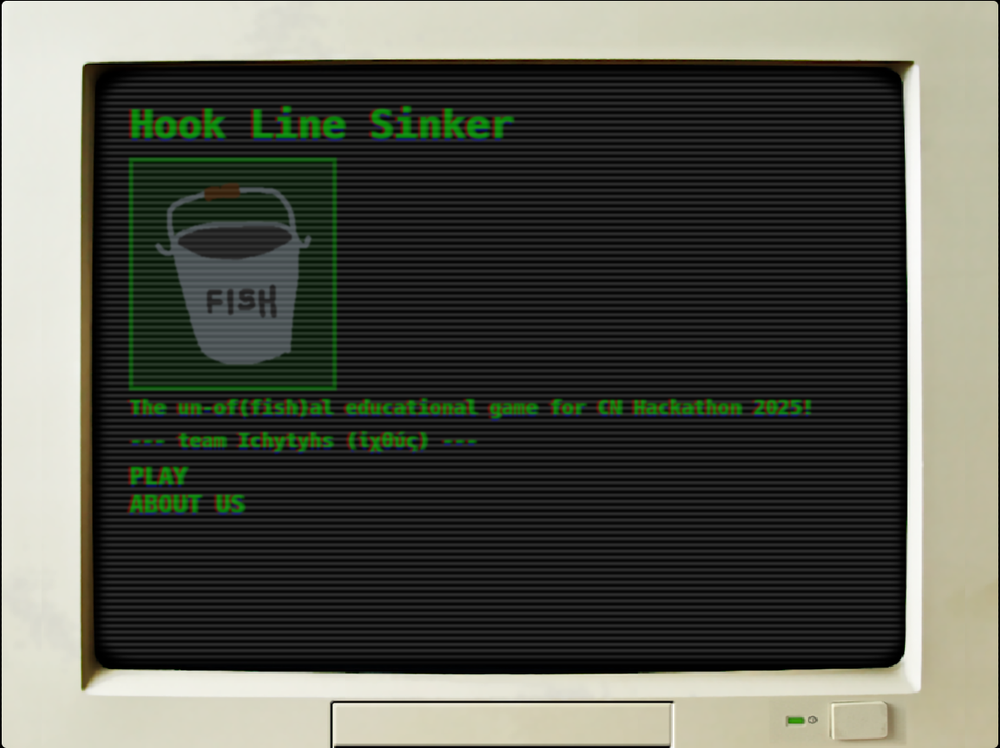
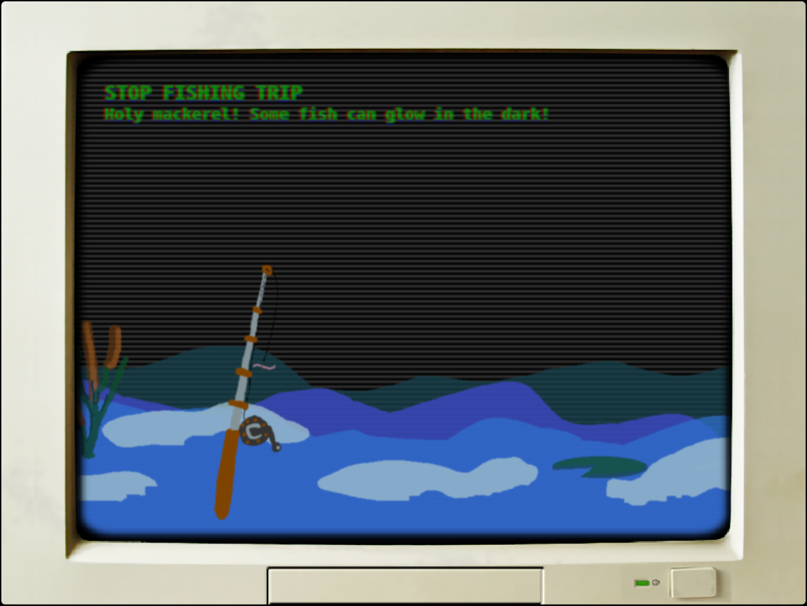
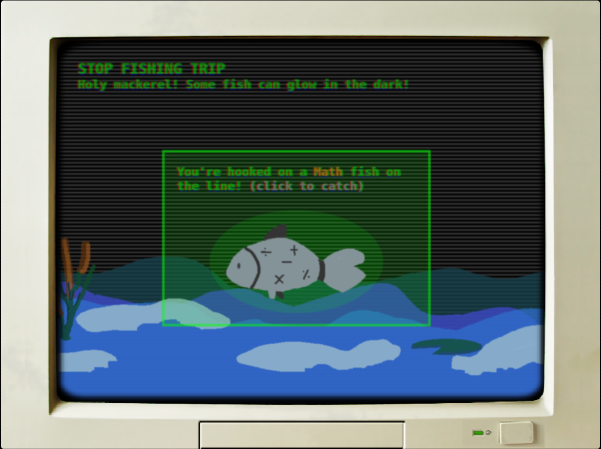
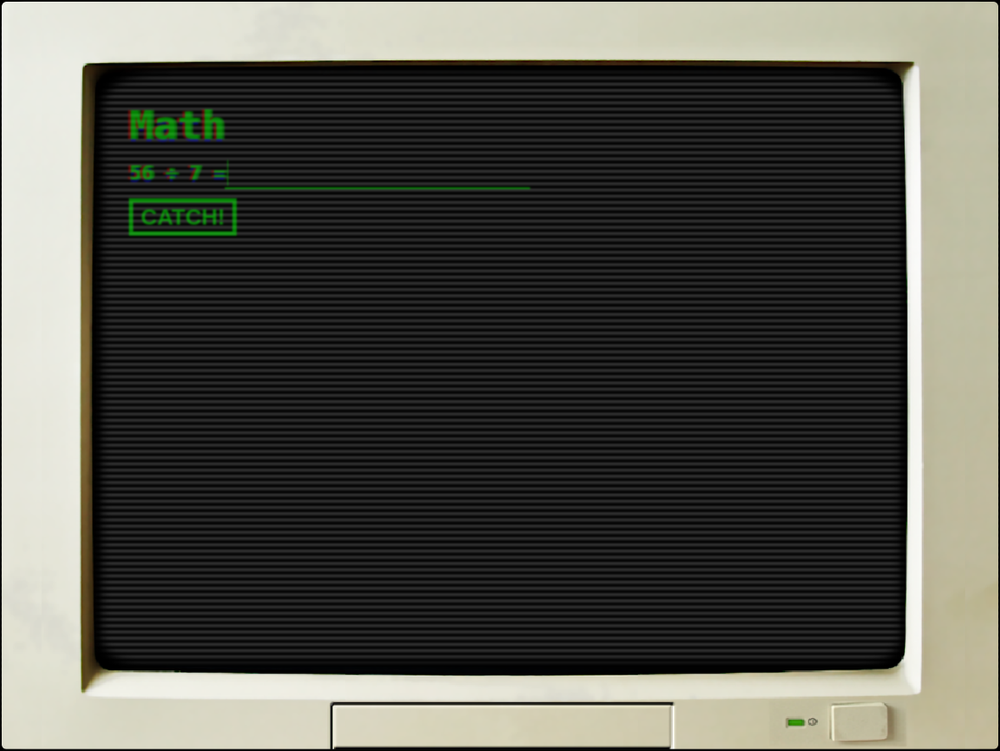
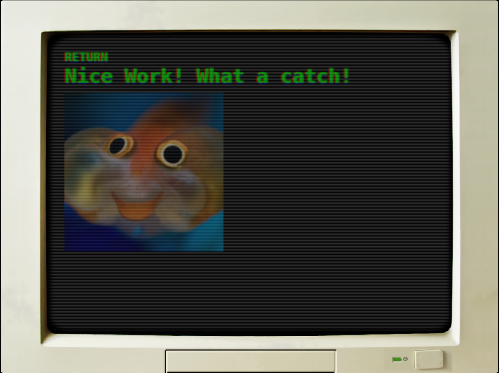

# HookLineSinker
Hook Line Sinker is a retro fishing game with a focus on education, a retro re-imagining of a gamified future of education. Built for the 2025 Code Network Hackathon.

Cast your fishing rod, hook fish, answer questions to catch fish.

## Showcase
### Main Menu

### Cast Your Rod

### You Have Hooked a Fish!

### Time To Solve

### Success!

## Setup
1. Install [golang](https://go.dev/learn/)
2. Install templating tool for golang [templ.guide](https://templ.guide/)
    - Run `go get -tool github.com/a-h/templ/cmd/templ@latest`

## Build and Run
1. `go tool templ generate` (rebuilds templates)
2. `go run cmd/app/main.go` (runs backend)
    - or combine both commands into
    
    `go tool templ generate && go run cmd/app/main.go`
3. Open your browser and goto `localhost:3000`

## Help
- [templ](https://templ.guide/)
- [Golang](https://gobyexample.com/)
- [htmx](https://htmx.org/)
